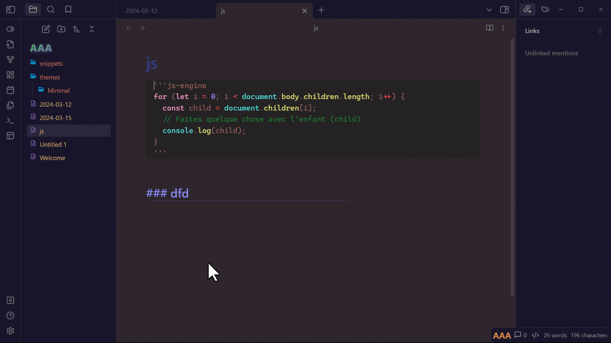

# Editor Full Screen

Ideal for presentations or to have a better perspective to work

Full screen mode: only the file content is shown. by default the status bar is hidden (see settings) (hotkey suggestion ctrl+alt+f)

Zen Mode: the navigation bar is still visible. (hotkey suggestion alt+f) 

It fits to the window content. So you can split, resize your OS window it will fit in

